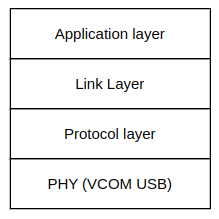
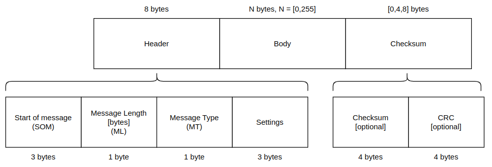

# Computer Scientist Calculator Communication Protocol

This directory contains the unified communications protocol used by
the comSciCalc and PC software, where the units are assumed to be connected
by serial interface, e.g., UART or USB VCOM. 

## Background
The serial interface enables two-way communication between the host (computer) and the device (calculator). In the interest of not blasting the host with unwanted information, the device shall not communicate the state unless the host has explicitly connected to the device. 

Hence, there is a set of messages required to facilitate connection and disconnection between the host and the device. 

The intended host applications are: 
* PC GUI
* Hardware-in-the-loop feature testing

Once the device is connected to the host, there are multiple states and/or events that are allowed, for which the base set of changing settings and communicating with the solver are required. 
Since the calculator supports both user defined functions and programs, there is going to be a limit as to what the protocol can support, especially in regards to custom programs. 
As a guide, there shall be a set of graphical functions that will be supported, but there is no requirement for the user to only use these for a custom function. However, if those functions are used, the protocol shall allow compatibility with them. 

## Software stack
The OSI stack model for this interface is shown in Figure 1 below. 

*Figure 1. OSI stack model.*

The PHY is simply the USB VCOM layer, and is not specific in this document. 

The protocol layer specifies how the message bytes are arranged, and how the data and metadata is transferred between host and device. 

The link layer focuses on the body of the protocol layer message, and specifies how the binary data is decoded. 

Finally, the application layer is a purely software defined layer which consumes the link layer data, where the data itself is decoded. 

# Protocol Layer
This section documents the protocol and messages used by the serial interface. 
The message structure is shown in Figure 2 below. 

*Figure 2. Message structure.*

As seen in Figure 2, the header consists of four fields, where the SOM indicates the start of communication. Since the device supports regular ASCII communication via a virtual COM port, to support context switching from ASCII reception to receiving this protocol, an [escape sequence](https://en.wikipedia.org/wiki/ANSI_escape_code) is used to differentiate the two. 
The APC (0x1B 5F 9F) sequence is re-used here, since it’s rarely implemented and can therefore easily be differentiated from other escape sequences. This field is not variable. 

The message length is indicating the length of the body, which is the data containing the message itself. Note that it’s indicating only the body length, not including the header or checksum. 

The message type indicates the type of message being sent (duh), where the message type indicates if the received message is a connection event, ack, data transfer etc.

The three byte settings field is partly used to indicate the settings used for the message, e.g., checksum configuration, body encoding and more, along with byte padding for the body. 

The body is the data itself, and the length in bytes of the data is decided by the ML field. From the protocol side, the body is handled just as binary data without any indications as to where that data is used, so the protocol does not differentiate depending on what data is being transferred. 

Finally, the checksum has two optional fields: Checksum and CRC, where either can be used. Both the checksum and CRC include both header and body. 

This format is used both from the host to device, and from device to host.

See Table 1 below for an overview of the different fields. 

*Table 1. OVerview of different fields*
Field | Accepted value(s) | Description
|:------ |:-----------| :---------------------------------------------------:|
SOM    | `0x1B5F9F` |   Start Of Message: This is a fixed value and  indicates the start of a message if prior  message has been terminated, or if timeout has been reached. 
ML | 0-255 | Message Length: Body length in Bytes
MT | `0x01` Data Transfer   `0x02` ACK  `0x04` NACK   `0x08` Retransmission  `0xF0` Reserved|Message Type: Type(s) of messages. A combination (OR) of the types are available.  Data Transfer: Transfer of data. Data will be forwarded to the link layer.  ACK: Acknowledgement.  NACK: Negative Acknowledgement. Retransmission: This message is a retransmission of a previous message.
Settings | `0x000001` Use Checksum `0x000002` Use CRC `0x000XX0` Timeout `0x0XX000` Retries `0xF00004` Reserved  | Settings: These fields are bitwise ORed, and indicate protocol layer settings 
Body|Any|Data packets
Checksum|Any|Checksum (algorithm TBD)
CRC|Any|CRC (algorithm TBD)

## Message Types
The message types indicate the message being sent, and a message containing data can also contain information regarding the last message(ACK,NACK). 

### Data Transfer
If the message type is data transfer, it is assumed but not guaranteed that the body contains data. However, if the data transfer bit is 0, the body must be empty.

### Acknowledgement
If the message type ACK bit is set, it means that the last message was received correctly. If no previous message exists (e.g. connection event), the ACK and NACK can be set to 0. 
The NACK bit aims to indicate that the last message sent had an error. This could indicate that the connection was severed or interrupted, CRC error or any other error corrupting the last message. 

Note that a data transfer can contain an ACK or NACK, meaning that the reception of a message containing data can acknowledge the previous message sent.

A received ACK or NACK is always in relation to the last transmitted message, so full duplex support is limited. Each message must be acknowledged before the next message can be transmitted. 

### Retransmission
If a NACK is received, the transmitter shall retransmit the previous message with the retransmission bit set. Retransmission of the previous message shall be supported by both the device and host. 
The retransmission needs to be acknowledged just like any data transfer, and the bit only indicates that a retransmission is occurring. 

Note that retransmissions here are only valid for issues on the protocol layer, and do not need to be communicated from the link layer. If the link layer needs a retransmission, it has the capability to request it as well, but that is not covered here.

## Settings
The settings simply indicate the settings to be used for the packet. 

### Use Checksum
If “use checksum” is set, then checksum shall be transmitted, received and checked on 
reception. A faulty received checksum shall produce a NACK on the next transmitted message. 

### Use CRC
If “use CRC” is set, then CRCll be transmitted, received and checked on 
reception. A faulty received CRC which cannot recover the data shall produce a NACK on the next transmitted message. 

### Timeout
The timeout section indicates the time to wait for an acknowledgement. No new message can be transmitted until the previous message has been acknowledged, so a timeout event is treated as a NACK. The values in the timeout field are in relation to the LUT in Table 2 below, and as seen the timeout value increases with a factor 10 per value of bits 0-3, and bits 4-15 indicate the multiplier. The final timeout value is the multiplier times the base. 
E.g. 50 ms is multiplier 5 and base 10 ms. 

*Table 2. Timeout bases and multipliers*
Timeout setting value | Timeout
|:------------------- | :-----------:|
Bits 0-2: `0x0`         | base: 1 ms
Bits 0-2: `0x1`         |base: 10 ms
Bits 0-2: `0x2`         |base: 100 ms
Bits 0-2: `0x3`         |base: 1000 ms
Bits 3-15: `0x1`        |multiplier: 1
Bits 3-15: `0x2`        |multiplier: 2
Bits 3-15: `0x3`        |multiplier: 3
Bits 3-15: `0x4`        |multiplier: 4
and so on...

The timeout is on a per message basis, so the transmitter tells how long it will wait for an acknowledgement. There is no algorithm for setting this rate based on retransmission, other than it should be set to as low as possible without causing retransmissions. 

### Retries
Retries simply indicate how many retransmissions can be made before a connection is severed. 
If the retries number messages are not successfully acknowledged, the connection is assumed to be severed, and a connection event is required to establish a new connection. 

As of writing this spec, the default number of retries is set to be 3. 
If a retransmission is made, either by NACK or timeout, this field decreases, and if retries = 0 and the message is not ACKed, the connection will be severed. 
It is also a good idea, although not enforced, to increase the timeout per decrementation of this field. This feature is left to the implementer. 

## Data Flow
The protocol itself, i.e. how data is flowing back and forth, is really very simple as it’s done over cable, meaning that it can be assumed that the packet loss is very small. 
There is no guarantee that data will arrive, nor arrive in sequence, but since it’s a point to point protocol that can easily be kept track of by the devices themselves. Since no PHY level interaction is available, ready to send and ready to receive can be assumed to be handled by the PHY already. Moreover, it is assumed that both host and device have sufficiently large receive buffers to hold a message while it’s being received. 

The following sections explain connection, disconnection, retransmission and regular transmission. 
Note that even though the physical layer might support full duplex, this protocol does not support full duplex, rather it’s simplex, where a receiver can assume to empty its receive buffer after a successful reception, and not lose any incoming messages. 

The protocol layer receives byte-per-byte, where it’s considered the largest byte to be first. So the first byte being received in any transmission is the SOM escape (27) byte. 

### Connection event
A connection can be initiated by any device, and is indicated by the initiator sending a message with data transfer = 0, ack = 0 and nack = 0. 
A connection is created if the initiator receives an acknowledged message (ACK=1, NACK=0) within the timeout period. 
Note that the connection by the responder is allowed to contain data. 

A connection event is the only message that can be transmitted without either an ACK or NACK, all messages after the initiator message must contain ACK or NACK. 

The retries section is not required to decrement if the initiator resends the connection event message. 

If a connection event message is NACKed, a connection cannot be made, and the initiator can retry. 

### Disconnection
A disconnection does not have a specified sequence, rather, if the retries counter expires (i.e. a message sent with retries = 0 is not ACKed), the connection is severed. So to sever a connection a device simply needs to stop responding, or NACK the number of retries. 

### Retransmission 
A retransmission shall happen after a message was unsuccessfully received, either by not being ACKed within the timeout, or not receiving a message within the specified timeout. 
If a retransmission is made, the retry counter shall be decremented. If a message is sent with retries = 0, and not ACKed, the connection is severed and the message cannot be assumed to be received. 
If a retransmission is ACKed, the retries counter can be reset to the default value. 

If a lot of retransmissions are observed, then it could be a good idea to increase the timeout, but it’s not enforced. 

### Timeout
A timeout is signified by a message not being received within the timeout period, as specified in the settings section. 

The time is counted from when the transmission is completed, i.e. the last bit is sent to the PHY layer, until the next header has been fully received. Note that the body does not need to be received to stop the timeout timer, since the body has variable length, while the header has a fixed length and is therefore more deterministic. 

Note that any reception of a header will stop the timer, so if the header includes an error it does not count towards a timeout error. Another way of looking at timeout is that the timeout timer shall stop after 8 bytes have been received.

### Inability to receive data
If the data receive queue is full, the protocol layer shall treat this as an inability to receive messages, meaning that if data is dropped due to insufficient queue space, a NACK is sent and the previous message is retransmitted and the queueing is retried the next time that same message is received. 
Inability to receive data due to queue size issues can cause a severed connection. 

### Idle data transmission
If no data is available in the transmission queue, then no data will be sent with the next message at the time of evaluating. 

If there is no data transmitted for a duration of time, i.e. the device and host are both idle, the timeout can be extended such that less data is being sent over the physical layer.
Since the timeout is decided by the transmitted message, the transmitter decides what the timeout should be, so some preemption can be made here. 
The receiver is allowed to wait to transmit a response, as long as it’s within the timeout.

# Link Layer (WIP)
The link layer focuses on the data of the packet, i.e. the body of the protocol layer. 
The link layer receives data from the protocol layer, but does not have control over the protocol layer, so cannot request retransmissions by the protocol layer. 
However, the protocol layer tries its best to verify that all bytes have been received, such that the integrity of the data received by the link layer is good. 
It’s not foolproof but the checksum and CRC should indicate that the received data is at least intact. 
The protocol layer does not guarantee that the received data is sequential though, so steps have to be taken in the link layer to request retransmissions if needed. 

Note that the link layer and protocol layer is separated such that the link layer is protocol agnostic, and it is simply a way of translating the data from just received bits into something that can be used by the comSciCalc device and host. 
Hence, the link layer cannot have any say into what the protocol layer is doing here, and should there be an update in the protocol layer, or change of protocol overall, the link layer should be reusable. 

The link layer data consists of two parts: a header and the raw data itself, and as opposed to the link layer/protocol layer separation, the link layer and application layer does not easily separate. This is due to the construction of the link layer header. 

The link layer receives the significant byte first from the protocol layer, or if received as a pointer, the pointer points to the start of the header. 
Hence, the link layer receives data and length of that data from the protocol layer, and can read the data. There is no flow control between the protocol layer and link layer, other than what can be facilitated by regular queues. 
Moreover, transmissions from the link layer can be handled by queues, not specified here, although with the current implementation of the comSciCalc firmware it’s using FreeRTOS.
The queue size is fixed at compile time, and shared between the protocol layer and link layer. 

## Header
The header decides what the intention of the data is, and thereby how it should be decoded. 
Data here can be, per default, any one of the following types:
* ComSciCalc State
  * Always sent from the device to the host
  * This is mainly aimed to mirror the screen on the calculator to the PC
* ComSciCalc input
  * Always sent from the host to the device
  * This is input to the calculator, in the form of numbers
* Request for data
  * This is a request for the devices internal states
  * This can be used to synchronize the device and the host
* Response for data
  * This is the response for the request
* New program
  * There is space in the flash for custom programs, accessible via the menu
  * This command sends the binary data and where to store it, along with metadata such that the program can be accessible via the menu. 
